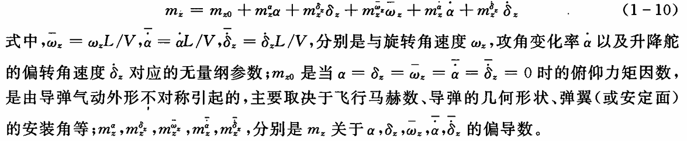
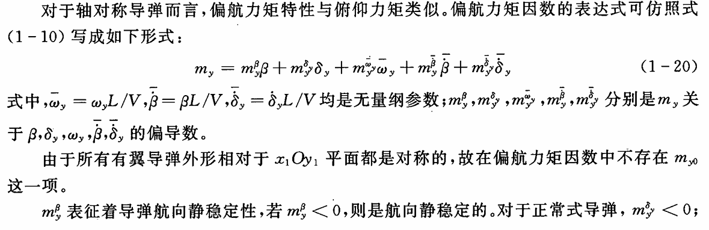
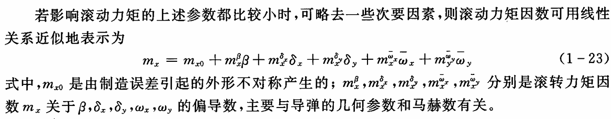
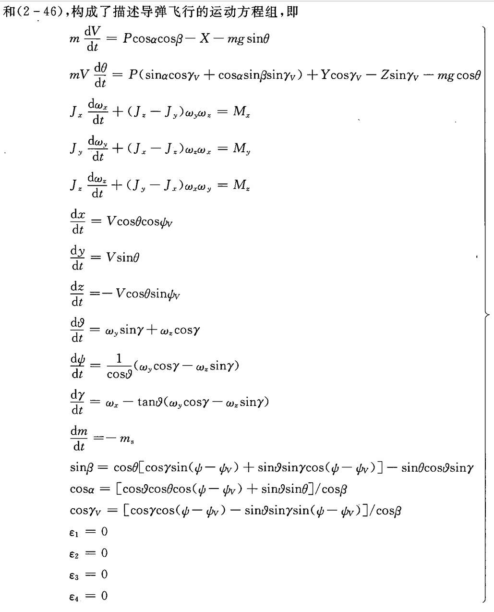

放在py中，线性化整定一堆参数。具体怎么来的要看个半天

最终一坨


一个庞大的方程，连用代码实现它都觉得烦
一步一步来：
用的是机体坐标系
利用AI帮我整理公式：

# 飞行器空气动力方程

## 1. 空气动力 (Aerodynamic Forces)

### 1.1. 升力 (Lift, $L$)
$$
L = \frac{1}{2} \rho V^2 S_{ref} (C'_{L_0} + C'_{L_\alpha} \alpha + C'_{L_\beta} \beta + C'_{L_p} \frac{p L_{ref}}{2V} + C'_{L_r} \frac{r L_{ref}}{2V} + C'_{L_{\delta_e}} \delta_e + C'_{L_{\delta_t}} \delta_t) + \dots
$$

### 1.2. 阻力 (Drag, $D$)
$$
D = \frac{1}{2} \rho V^2 S_{ref} (C'_{D_0} + C'_{D_\alpha} \alpha + C'_{D_\beta} \beta + C'_{D_p} \frac{p L_{ref}}{2V} + C'_{D_r} \frac{r L_{ref}}{2V} + C'_{D_{\delta_e}} \delta_e + C'_{D_{\delta_t}} \delta_t) + \dots
$$

### 1.3. 侧向力 (Side Force, $Y$)
$$
Y = \frac{1}{2} \rho V^2 S_{ref} (C'_{Y_0} + C'_{Y_\alpha} \alpha + C'_{Y_\beta} \beta + C'_{Y_p} \frac{p L_{ref}}{2V} + C'_{Y_r} \frac{r L_{ref}}{2V} + C'_{Y_{\delta_r}} \delta_r + C'_{Y_{\delta_t}} \delta_t) + \dots
$$

## 2. 空气动力矩 (Aerodynamic Moments)

### 2.1. 俯仰力矩 (Pitching Moment, $M$)
$$
M = \frac{1}{2} \rho V^2 S_{ref} L_{ref} (C'_{m_0} + C'_{m_\alpha} \alpha + C'_{m_\beta} \beta + C'_{m_p} \frac{p L_{ref}}{2V} + C'_{m_r} \frac{r L_{ref}}{2V} + C'_{m_{\delta_e}} \delta_e + C'_{m_{\delta_t}} \delta_t) + \dots
$$

### 2.2. 滚转力矩 (Rolling Moment, $L$)
$$
L = \frac{1}{2} \rho V^2 S_{ref} L_{ref} (C'_{l_0} + C'_{l_\alpha} \alpha + C'_{l_\beta} \beta + C'_{l_p} \frac{p L_{ref}}{2V} + C'_{l_r} \frac{r L_{ref}}{2V} + C'_{l_{\delta_r}} \delta_r + C'_{l_{\delta_t}} \delta_t) + \dots
$$

### 2.3. 偏航力矩 (Yawing Moment, $N$)
$$
N = \frac{1}{2} \rho V^2 S_{ref} L_{ref} (C'_{n_0} + C'_{n_\alpha} \alpha + C'_{n_\beta} \beta + C'_{n_p} \frac{p L_{ref}}{2V} + C'_{n_r} \frac{r L_{ref}}{2V} + C'_{n_{\delta_r}} \delta_r + C'_{n_{\delta_t}} \delta_t) + \dots
$$

---

## 相关参数定义 (Associated Parameter Definitions)

*   $\rho$: 空气密度 (Air Density)
*   $V$: 空速 (Airspeed, $V = |\mathbf{v}_b|$ )
*   $S_{ref}$: **参考面积** (Reference Area) - 例如：弹翼总面积，弹体横截面积等。
*   $L_{ref}$: **参考长度** (Reference Length) - 例如：弹体长度，弹翼平均弦长等。
*   $\alpha$: 迎角 (Angle of Attack)
*   $\beta$: 侧滑角 (Sideslip Angle)
*   $\delta_e$: 升降舵/配平舵偏转角 (Elevator/Stabilizer Deflection)
*   $\delta_a$: 副翼/副翼舵偏转角 (Aileron/Stabilizer Deflection)
*   $\delta_r$: 方向舵/尾舵偏转角 (Rudder/Tail Fin Deflection)

---

## 空气动力系数 (Aerodynamic Coefficients) - **有效系数 (Effective Coefficients)**

这里的系数是经过几何参数“吸收”后的新的系数，需要根据你的飞行器实际情况进行整定。

*   **零值系数 (Zero-Value Coefficients):**
    *   $C'_{L_0}, C'_{D_0}, C'_{Y_0}, C'_{m_0}, C'_{l_0}, C'_{n_0}$
*   **迎角相关系数 (Angle of Attack Coefficients):**
    *   $C'_{L_\alpha}, C'_{D_\alpha}, C'_{Y_\alpha}, C'_{m_\alpha}, C'_{l_\alpha}, C'_{n_\alpha}$
*   **侧滑角相关系数 (Sideslip Angle Coefficients):**
    *   $C'_{L_\beta}, C'_{D_\beta}, C'_{Y_\beta}, C'_{m_\beta}, C'_{l_\beta}, C'_{n_\beta}$
*   **角速度相关系数 (Angular Velocity Coefficients):**
    *   $C'_{L_q}, C'_{D_q}, C'_{Y_q}, C'_{m_q}, C'_{l_q}, C'_{n_q}$ (俯仰角速度 $q$)
    *   $C'_{L_p}, C'_{D_p}, C'_{Y_p}, C'_{m_p}, C'_{l_p}, C'_{n_p}$ (滚转角速度 $p$)
    *   $C'_{L_r}, C'_{D_r}, C'_{Y_r}, C'_{m_r}, C'_{l_r}, C'_{n_r}$ (偏航角速度 $r$)
*   **迎角变化率相关系数 (Rate of Change of Angle of Attack Coefficients):**
    *   $C'_{m_{\dot{\alpha}}}$
*   **舵面偏转相关系数 (Control Surface Deflection Coefficients):**
    *   $C'_{L_{\delta_e}}, C'_{D_{\delta_e}}, C'_{Y_{\delta_e}}, C'_{m_{\delta_e}}, C'_{l_{\delta_e}}, C'_{n_{\delta_e}}$ (升降舵/配平舵 $\delta_e$)
    *   $C'_{L_{\delta_a}}, C'_{D_{\delta_a}}, C'_{Y_{\delta_a}}, C'_{m_{\delta_a}}, C'_{l_{\delta_a}}, C'_{n_{\delta_a}}$ (副翼/副翼舵 $\delta_a$)
    *   $C'_{L_{\delta_r}}, C'_{D_{\delta_r}}, C'_{Y_{\delta_r}}, C'_{m_{\delta_r}}, C'_{l_{\delta_r}}, C'_{n_{\delta_r}}$ (方向舵/尾舵 $\delta_r$)

---

## 变量定义 (Variable Definitions)

*   **本体参考系下的速度向量 (Velocity Vector in Body Frame):**
    $\mathbf{v}_b = \begin{bmatrix} u \\ v \\ w \end{bmatrix}$
    *   $u$: 前向速度 (Forward Velocity)
    *   $v$: 右向速度 (Rightward Velocity)
    *   $w$: 下向速度 (Downward Velocity)

*   **本体参考系下的角速度向量 (Angular Velocity Vector in Body Frame):**
    $\boldsymbol{\omega}_b = \begin{bmatrix} p \\ q \\ r \end{bmatrix}$
    *   $p$: 滚转角速度 (Roll Rate)
    *   $q$: 俯仰角速度 (Pitch Rate)
    *   $r$: 偏航角速度 (Yaw Rate)

*   **迎角和侧滑角计算 (Calculation of Angle of Attack and Sideslip Angle):**
    $\alpha = \text{atan2}(w, u)$
    $\beta = \text{atan2}(-v, \sqrt{u^2 + w^2})$
    *(注意：这里的 atan2 参数和符号约定可能需要根据实际情况调整。)*

---

## 动力学方程中的空气动力学力的转换

空气动力计算在本体参考系下得到 $\mathbf{F}_{aero} = [ -D, Y, -L ]^T$ (通常阻力定义为负向，升力定义为负向，与坐标系约定有关，这里按通常的右手系约定，L为正值，D为负值，Y为正值，所以如果L是向上的，则为$-L$，如果D是向后的，则为$-D$。这里假设 $\mathbf{v}_b$ 的 $w$ 向下为正，因此升力 $L$ 沿着 $-\mathbf{w}$ 方向。如果 $w$ 向下为正，那么升力 $L$ 实际上是沿着 $-w$ 方向的，即 $F_{aero\_w} = -L$. 阻力 $D$ 沿着 $-u$ 方向，即 $F_{aero\_u} = -D$. 侧向力 $Y$ 沿着 $v$ 方向，即 $F_{aero\_v} = Y$. )

**实际的本体参考系下的力向量应为：**
$\mathbf{F}_{aero\_body} = \begin{bmatrix} -D \\ Y \\ -L \end{bmatrix}$

**然后转换到惯性参考系：**
$\mathbf{F}_{aero\_inertial} = \mathbf{R}_{bi} \mathbf{F}_{aero\_body}$

**空气动力矩在本体参考系下直接使用：**
$\mathbf{M}_{aero\_body} = \begin{bmatrix} L \\ M \\ N \end{bmatrix}$ (这里 L 是滚转力矩，M 是俯仰力矩，N 是偏航力矩)


然后把这一坨玩意整顿成代码，体力活，也是AI生成

```python
# --- 常量定义 (Constants Definition) ---
# 物理常量
rho = 0.0  # 空气密度 (Air Density) - 示例值，需根据实际情况设置
g = 9.81   # 重力加速度 (Gravitational Acceleration) - 示例值

# 飞行器结构参数 (Aircraft Structural Parameters)
S_ref = 0.0 # 参考面积 (Reference Area) - 例如：弹翼总面积
L_ref = 0.0 # 参考长度 (Reference Length) - 例如：弹体长度

# 惯性参数 (Inertial Parameters)
m = 0.0     # 飞行器质量 (Aircraft Mass)
Ix = 0.0    # 绕 x 轴转动惯量 (Moment of Inertia about x-axis)
Iy = 0.0    # 绕 y 轴转动惯量 (Moment of Inertia about y-axis)
Iz = 0.0    # 绕 z 轴转动惯量 (Moment of Inertia about z-axis)
Ixy = 0.0   # 惯量积 (Product of Inertia)
Iyz = 0.0   # 惯量积
Izx = 0.0   # 惯量积

# --- 空气动力系数 (Aerodynamic Coefficients) ---
# 这些是"有效"系数，已经吸收了S_ref, L_ref等几何参数

# 零值系数 (Zero-Value Coefficients)
CL0 = 0.0; CD0 = 0.0; CY0 = 0.0
Cm0 = 0.0; Cl0 = 0.0; Cn0 = 0.0

# 迎角相关系数 (Angle of Attack Coefficients)
CL_alpha = 0.0; CD_alpha = 0.0; CY_alpha = 0.0
Cm_alpha = 0.0; Cl_alpha = 0.0; Cn_alpha = 0.0

# 侧滑角相关系数 (Sideslip Angle Coefficients)
CL_beta = 0.0; CD_beta = 0.0; CY_beta = 0.0
Cm_beta = 0.0; Cl_beta = 0.0; Cn_beta = 0.0

# 角速度相关系数 (Angular Velocity Coefficients)
# 俯仰角速度 q
CL_q = 0.0; CD_q = 0.0; CY_q = 0.0
Cm_q = 0.0; Cl_q = 0.0; Cn_q = 0.0
# 滚转角速度 p
CL_p = 0.0; CD_p = 0.0; CY_p = 0.0
Cm_p = 0.0; Cl_p = 0.0; Cn_p = 0.0
# 偏航角速度 r
CL_r = 0.0; CD_r = 0.0; CY_r = 0.0
Cm_r = 0.0; Cl_r = 0.0; Cn_r = 0.0

# 迎角变化率相关系数 (Rate of Change of Angle of Attack Coefficients)
Cm_alphadot = 0.0

# 舵面偏转相关系数 (Control Surface Deflection Coefficients)
# 升降舵/配平舵 de
CL_de = 0.0; CD_de = 0.0; CY_de = 0.0
Cm_de = 0.0; Cl_de = 0.0; Cn_de = 0.0
# 副翼/副翼舵 da
CL_da = 0.0; CD_da = 0.0; CY_da = 0.0
Cm_da = 0.0; Cl_da = 0.0; Cn_da = 0.0
# 方向舵/尾舵 dr
CL_dr = 0.0; CD_dr = 0.0; CY_dr = 0.0
Cm_dr = 0.0; Cl_dr = 0.0; Cn_dr = 0.0

# --- 函数定义 (Function Definitions) ---

def calculate_aerodynamic_forces_moments(v_b, omega_b, alpha, beta, delta_e, delta_a, delta_r, rho, S_ref, L_ref):
    """
    计算空气动力和空气动力矩 (Calculates aerodynamic forces and moments)
    :param v_b: 本体参考系下的速度向量 [u, v, w] (Velocity vector in body frame [u, v, w])
    :param omega_b: 本体参考系下的角速度向量 [p, q, r] (Angular velocity vector in body frame [p, q, r])
    :param alpha: 迎角 (Angle of Attack)
    :param beta: 侧滑角 (Sideslip Angle)
    :param delta_e: 升降舵/配平舵偏转角 (Elevator/Stabilizer Deflection)
    :param delta_a: 副翼/副翼舵偏转角 (Aileron/Stabilizer Deflection)
    :param delta_r: 方向舵/尾舵偏转角 (Rudder/Tail Fin Deflection)
    :param rho: 空气密度 (Air Density)
    :param S_ref: 参考面积 (Reference Area)
    :param L_ref: 参考长度 (Reference Length)
    :return: aeroforces_body (本体参考系下的力向量 [-D, Y, -L]), aeromoments_body (本体参考系下的力矩向量 [L, M, N])
    """
    u, v, w = v_b
    p, q, r = omega_b
    
    # 空速 (Airspeed)
    V = (u**2 + v**2 + w**2)**0.5
    if V == 0: return [0.0, 0.0, 0.0], [0.0, 0.0, 0.0] # 避免除以零

    # 空气动力系数计算 (Aerodynamic Coefficient Calculation)
    # 升力系数 (Lift Coefficient)
    CL = CL0 + CL_alpha * alpha + CL_beta * beta + CL_q * (q * L_ref / (2 * V)) + \
         CL_p * (p * L_ref / (2 * V)) + CL_r * (r * L_ref / (2 * V)) + \
         CL_de * delta_e + CL_da * delta_a + CL_dr * delta_r
         
    # 阻力系数 (Drag Coefficient)
    CD = CD0 + CD_alpha * alpha + CD_beta * beta + CD_q * (q * L_ref / (2 * V)) + \
         CD_p * (p * L_ref / (2 * V)) + CD_r * (r * L_ref / (2 * V)) + \
         CD_de * delta_e + CD_da * delta_a + CD_dr * delta_r
         
    # 侧向力系数 (Side Force Coefficient)
    CY = CY0 + CY_alpha * alpha + CY_beta * beta + CY_q * (q * L_ref / (2 * V)) + \
         CY_p * (p * L_ref / (2 * V)) + CY_r * (r * L_ref / (2 * V)) + \
         CY_de * delta_e + CY_da * delta_a + CY_dr * delta_r

    # 俯仰力矩系数 (Pitching Moment Coefficient)
    Cm = Cm0 + Cm_alpha * alpha + Cm_beta * beta + Cm_q * (q * L_ref / (2 * V)) + \
         Cm_alphadot * ( (alpha * L_ref / V) / 2.0) + \
         Cm_de * delta_e + Cm_da * delta_a + Cm_dr * delta_r # alphadot 假设与 q 相关，这里用 q*L_ref/V 简化，需要更精确的计算
         
    # 滚转力矩系数 (Rolling Moment Coefficient)
    Cl = Cl0 + Cl_alpha * alpha + Cl_beta * beta + Cl_p * (p * L_ref / (2 * V)) + \
         Cl_r * (r * L_ref / (2 * V)) + Cl_de * delta_e + Cl_da * delta_a + Cl_dr * delta_r

    # 偏航力矩系数 (Yawing Moment Coefficient)
    Cn = Cn0 + Cn_alpha * alpha + Cn_beta * beta + Cn_p * (p * L_ref / (2 * V)) + \
         Cn_r * (r * L_ref / (2 * V)) + Cn_de * delta_e + Cn_da * delta_a + Cn_dr * delta_r

    # 计算力和力矩 (Calculate Forces and Moments)
    # 力 (Forces) - 注意 D 和 L 的符号约定
    D = 0.5 * rho * V**2 * S_ref * CD
    Y = 0.5 * rho * V**2 * S_ref * CY
    L = 0.5 * rho * V**2 * S_ref * CL
    
    # 力矩 (Moments)
    M = 0.5 * rho * V**2 * S_ref * L_ref * Cm
    Roll_Moment = 0.5 * rho * V**2 * S_ref * L_ref * Cl
    N = 0.5 * rho * V**2 * S_ref * L_ref * Cn
    
    # 本体参考系下的力向量 (Force vector in body frame)
    # -D (阻力), Y (侧向力), -L (升力, 假设L向上)
    aeroforces_body = [-D, Y, -L] 
    # 本体参考系下的力矩向量 (Moment vector in body frame)
    # L (滚转), M (俯仰), N (偏航)
    aeromoments_body = [Roll_Moment, M, N]
    
    return aeroforces_body, aeromoments_body

def calculate_alpha_beta(v_b):
    """
    计算迎角和侧滑角 (Calculates Angle of Attack and Sideslip Angle)
    :param v_b: 本体参考系下的速度向量 [u, v, w]
    :return: alpha, beta
    """
    u, v, w = v_b
    # alpha = atan2(w, u) # 假设 w 向下为正
    # beta = atan2(-v, sqrt(u^2 + w^2)) # 假设 v 向右为正
    import math
    alpha = math.atan2(w, u)
    beta = math.atan2(-v, math.sqrt(u**2 + w**2))
    return alpha, beta

# --- 质心运动方程 (Center of Mass Motion Equations) ---
# F_total_inertial = m * a_inertial
# 这里的 F_total_inertial 需要包含空气动力、重力、推力等，并进行坐标转换
# 举例：
# F_aero_inertial = R_bi @ aeroforces_body # 假设 R_bi 是旋转矩阵
# F_gravity_inertial = R_bi @ [0, 0, -m*g] # 假设重力在惯性系下是 [0, 0, -mg] (z向上)
# F_total_inertial = F_aero_inertial + F_gravity_inertial + F_thrust_inertial # F_thrust_inertial 需自行计算

# --- 力矩方程 (Moment Equations) ---
# M_total_body = I_b @ domega_b_dt + omega_b x (I_b @ omega_b)
# 这里的 M_total_body 需要包含空气动力矩、推力矩等
# 举例：
# M_total_body = aeromoments_body + M_thrust_body # M_thrust_body 需自行计算
# I_b 是本体参考系下的惯性张量
# domega_b_dt = [dp, dq, dr]
# omega_b x (I_b @ omega_b) 是科氏力项

# --- 旋转矩阵 (Rotation Matrix) ---
# R_bi: 从本体参考系到惯性参考系的旋转矩阵 (Body to Inertial)
# R_ib: 从惯性参考系到本体参考系的旋转矩阵 (Inertial to Body)
# R_ib = np.linalg.inv(R_bi)

```

几个重要函数  
### mj_applyFT
```
void mj_applyFT(const mjModel* m, mjData* d, const mjtNum force[3], const mjtNum torque[3],
                const mjtNum point[3], int body, mjtNum* qfrc_target);
```
此函数可用于将笛卡尔力矩作用于刚体上的一个点，并将结果添加到所有施加力的向量 mjData.qfrc_applied 中。请注意，此函数需要指向该向量的指针，因为有时我们希望将结果添加到不同的向量中。

### mj_objectVelocity
```
void mj_objectVelocity(const mjModel* m, const mjData* d,
                       int objtype, int objid, mjtNum res[6], int flg_local);
```
计算物体在以物体为中心的坐标系中的 6D 速度（旋转:平移），世界/局部方向。

   
### tips:  
MuJoCo 提供原生 Python 绑定，这些绑定是使用 pybind11 用 C++ 开发的。Python API 与底层的 C API 保持一致。这导致了一些非 Pythonic 的代码结构（例如函数参数的顺序），但其好处是 API 文档 同时适用于这两种语言。

[API链接](https://docs.mujoco.cn/en/stable/APIreference/index.html)

10.2:特别注意
### mj_objectAcceleration
'''
void mj_objectAcceleration(const mjModel* m, const mjData* d,
                           int objtype, int objid, mjtNum res[6], int flg_local);'''

计算物体在以物体为中心的坐标系中的 6D 加速度（旋转:平移），世界/局部方向。如果模型中不存在加速度或力传感器，则必须手动调用 mj_rnePostConstraint 以计算 mjData.cacc——包括约束求解器贡献的总刚体加速度。